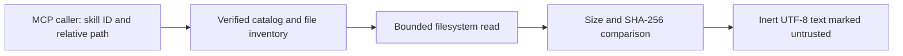

# Recorded case: review the bundle-read boundary

This case applies the scope, threat-model and verification steps of
[Security Audit for a Web App](../../../users/workflows.md#workflow-security-audit-for-a-web-app)
to the local MCP backend of the AAS catalog product. HTTP authentication, remote
penetration testing and deployed infrastructure are outside this case. The work
reviews owned source and disposable test fixtures; it does not execute inspected
skill payloads or probe third-party targets.

## Input and exact selection

The input is public source commit `251eefb9a58e36d41902dbc4a4fadc4eab72ab66`
in `sickn33/agentic-awesome-skills`. The sampled evidence fingerprints `package.json`,
`tools/lib/aas-v1/mcp/server.js` and `tools/lib/aas-v1/skill-files.js`. The actual
`tools/scripts/tests/aas_v1_skill_files.test.js` was also read and checked against
that commit before execution.

On 2026-09-05, Codex used the configured AAS 16.7.0 MCP to search and compare
candidates, then composed [this exact seven-skill manifest](aas-stack.json):

| Skill | Responsibility | Comparison and boundary |
| --- | --- | --- |
| `mcp-builder` | Local tool contract and client integration | More specific than `agent-tool-builder`; retain structured results and do not adopt unsupported tool-count or model-accuracy claims. |
| `javascript-pro` | Node file descriptors, buffers and errors | Compared with `modern-javascript-patterns`; use the existing CommonJS and Node APIs. |
| `invariant-guard` | Indexed identity, bounded reads and termination | Apply the contract checklist to the current algorithm, without claiming an automated proof. |
| `threat-modeling-expert` | Assets, caller input and filesystem trust | Compared with `stride-analysis-patterns` and `audit-skills`; the latter's heuristic score is not evidence of containment. |
| `javascript-testing-patterns` | Positive/negative boundary tests | Compared with `vitest-skill`; these tests use Node's runner, so no test-framework migration is appropriate. |
| `privacy-by-design` | Restrict returned content and avoid private-path disclosure | Image masking and HTTP account controls do not address this local boundary; no legal certification is claimed. |
| `antigravity-maintainer-batch-release` | Packed-runtime checks and protected integration | Compared with `repo-maintainer`; use the repository's exact current procedure. |

`file-path-traversal` was read as a candidate but its HTTP exploitation workflow
does not fit this defensive source review. Its string-prefix containment examples
are also insufficient for sibling paths; they were not copied into the implementation.
This is a content limitation to account for when inspecting that separate skill,
not evidence of such a bypass in AAS's current bundle reader.

All dimensions except user-facing UX/accessibility apply. The external integration
is the local MCP client; storage is the verified runtime's filesystem. The sidecar
records each responsibility explicitly. Search order and metadata do not confer
semantic approval.

## Threat model and observed controls



The assets are files outside the selected bundle, integrity of returned catalog
content and the host's ability to reject excessive or executable input. The caller
controls only the requested ID/path; the selected verified catalog supplies the
inventory and expected bytes.

| Threat | Observed check |
| --- | --- |
| Escape the bundle with absolute, encoded or parent paths | Reject invalid path segments, separators and encodings before reading; require an indexed file. |
| Substitute linked or changed content | Reject leaf/ancestor symlinks and hardlinks; compare descriptor identity, size, timestamps and directory identities, then the pinned digest. |
| Read an unbounded or growing payload | Reject inventory/actual size above 1 MiB; allocate and read only the bounded initial size. Each successful read advances the offset; an empty read fails. |
| Execute an inspected shell file | Read text only, mark it untrusted, and reject an `execute` argument. The executable fixture is never launched. |
| Misrepresent missing or non-text content | Return explicit inventory-unavailable, payload-unavailable, binary or size errors; do not fetch or return a partial substitute. |

This is a local read boundary, not a sandbox against an already privileged process
rewriting the host filesystem. Digest consistency also does not make malicious
instructions trustworthy. OS-level adversarial race certification is not claimed.

## Reproduce the executed checks

In a separate checkout at the input commit, with Node 24 and the repository's
Python prerequisites:

```bash
npm ci
npm run chain
node --test tools/scripts/tests/aas_v1_skill_files.test.js
```

Observed result: **7 tests passed** with Node 24.19.0. They verify real canonical
inventory pagination and a nested reference read, changed bytes, inert executable
text, traversal, unindexed paths, invalid limits, leaf/ancestor links, hardlinks,
missing payloads, old catalogs, binary/oversize rejection and MCP result identity.
The rejection fixtures are synthetic and disposable; the canonical support-file
read uses the actual repository payload. The product batch separately passed a
fresh packed-runtime smoke; that smoke is not a live native-client invocation of
the new file tools.

## Real selection and plan evidence

The [sidecar](aas-selection-evidence.json) contains the actual
`codex-mcp-client` 0.153.1 session history. Calls **77–99** belong to this case;
the 99-call trace also retains the two earlier cases. It is not edited into an
independent session or a success-only transcript. The agent supplied the scoped
project ledger; Core checked its structure and bindings, not its semantic coverage.

The native client used the published 16.7.0 catalog, which predates the new
`list_skill_files` and `read_skill_file` tools. Selection through that real client
and testing the newer source reader are different observations. No personal MCP
host was silently upgraded.

The published CLI validated the manifest, generated [plan.json](plan.json) and
reported `consistent` when auditing all three saved artifacts. The plan has seven
operations and left its isolated target empty. Its target identity is historical;
it cannot authorize a different installation.

To repeat the artifact audit, run outside an AAS source checkout and replace these
paths with the example's absolute paths:

```bash
npm exec --yes --ignore-scripts --package=agentic-awesome-skills@16.7.0 -- aas stack audit \
  --manifest /absolute/path/to/bundle-security/aas-stack.json \
  --evidence /absolute/path/to/bundle-security/aas-selection-evidence.json \
  --plan /absolute/path/to/bundle-security/plan.json
```

The result demonstrates the stated boundary checks and reproducible artifact
bindings. It does not certify the complete corpus, prove optimal skill selection,
measure model effectiveness or establish production security.
